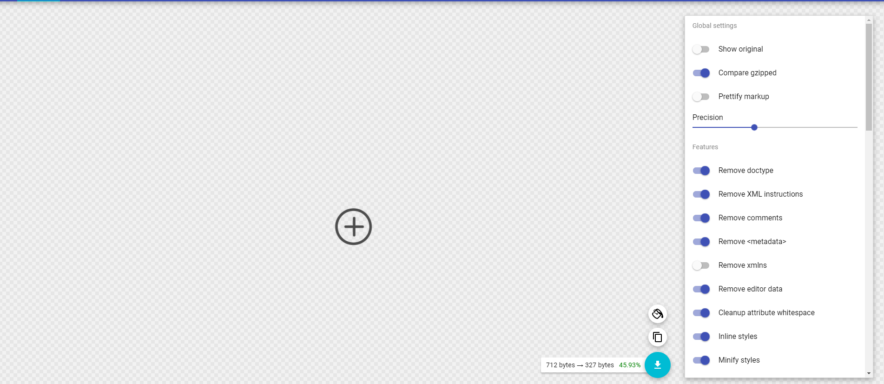
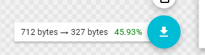

# Forge Icons

### Forge Icons are an extension of [Bootstrap Icons](https://bootstrap-vue.js.org/docs/icons/) which means they are themeable, accessible and scalable

# How to Add Icons

When you recieve a new icon from service design you can add it to the Forge UI Framework to make it available for everyone to use in all projects.

It is very easy to add a new icon, it only has two steps.

- Step 1 Clean up the SVG
- Step 2 Add Svg to Folder

## Step 1

After receving an icon it will have some extra data in it from Sktech that we dont want to serve into our application below is an example image.

```xml
<?xml version="1.0" encoding="UTF-8"?>
<svg width="20px" height="20px" viewBox="0 0 20 20" version="1.1" xmlns="http://www.w3.org/2000/svg" xmlnsXlink="http://www.w3.org/1999/xlink">
    <!-- Generator: Sketch 62 (91390) - https://sketch.com -->
    <title>add copy 2</title>
    <desc>Created with Sketch.</desc>
    <g id="Empty-States" stroke="none" stroke-width="1" fill="none" fill-rule="evenodd">
        <g id="add-copy-2" fill="#4C4C4C" fill-rule="nonzero">
            <path d="M10.0086133,0 C4.49612403,0 0,4.48275862 0,10 C0,15.5172414 4.4788975,20 10.0086133,20 C15.5211025,20 20,15.5172414 20,10 C20,4.48275862 15.5211025,0 10.0086133,0 Z M10.0086133,18.6034483 C5.27131783,18.6034483 1.41257537,14.7413793 1.41257537,10 C1.41257537,5.25862069 5.27131783,1.39655172 10.0086133,1.39655172 C14.7459087,1.39655172 18.6046512,5.25862069 18.6046512,10 C18.6046512,14.7413793 14.7459087,18.6034483 10.0086133,18.6034483 Z" id="Shape"></path>
            <path d="M14.95671,9.30735931 L11.04329,9.30735931 L11.04329,5.37662338 C11.04329,4.97835498 10.7316017,4.66666667 10.3333333,4.66666667 C9.93506494,4.66666667 9.62337662,4.97835498 9.62337662,5.37662338 L9.62337662,9.29004329 L5.70995671,9.29004329 C5.31168831,9.29004329 5,9.6017316 5,10 C5,10.3982684 5.31168831,10.7099567 5.70995671,10.7099567 L9.62337662,10.7099567 L9.62337662,14.6233766 C9.62337662,15.021645 9.93506494,15.3333333 10.3333333,15.3333333 C10.7316017,15.3333333 11.04329,15.021645 11.04329,14.6233766 L11.04329,10.7099567 L14.95671,10.7099567 C15.3549784,10.7099567 15.6666667,10.3982684 15.6666667,10 C15.6666667,9.6017316 15.3549784,9.30735931 14.95671,9.30735931 L14.95671,9.30735931 Z" id="Path"></path>
        </g>
    </g>
</svg>
```

To clean up the SVG you need to go to this website https://jakearchibald.github.io/svgomg/ and open the svg 

You can change the precision of the image to reduce the size however be careful about going to low as this can distort the image. However, you should notice a drastic reduction in file size e.g



When you are happy with the image and size click download add the image to the directory inside Forge UI.

It should look more like this, much smaller and cleaner

```xml
<svg width="20" height="20" xmlns="http://www.w3.org/2000/svg"><g fill="#4C4C4C" fill-rule="nonzero"><path d="M10.009 0C4.496 0 0 4.483 0 10s4.479 10 10.009 10C15.52 20 20 15.517 20 10S15.521 0 10.009 0zm0 18.603c-4.738 0-8.596-3.862-8.596-8.603s3.858-8.603 8.596-8.603c4.737 0 8.596 3.862 8.596 8.603s-3.86 8.603-8.596 8.603z"/><path d="M14.957 9.307h-3.914v-3.93a.702.702 0 00-.71-.71.702.702 0 00-.71.71V9.29H5.71A.702.702 0 005 10c0 .398.312.71.71.71h3.913v3.913c0 .399.312.71.71.71.399 0 .71-.311.71-.71V10.71h3.914c.398 0 .71-.312.71-.71 0-.398-.312-.693-.71-.693z"/></g></svg>
```

## Step 2

Add the icon to the Icons folder

The icon will be automatically converted from 'add-circle' to AddCircle

## Done

With everything done, the image will now be part of Forge and usable like this

```jsx
<b-icon icon="forge-add-circle"></b-icon>
```

## Congratulations your icon will be part of the next forge release
